<div align="center">

  <!-- ====================================================== -->
  <!-- 01 // CORE SYSTEM INITIALIZATION                       -->
  <!-- ====================================================== -->
  <a href="https://github.com/YasirAminBrohi">
    
  </a>

  <br/><br/>

  <!-- ====================================================== -->
  <!-- TACTICAL NAVIGATION BAR                                -->
  <!-- ====================================================== -->
  <p align="center">
    <a href="#-02--operator-profile"></a>
    <a href="#-03--the-software-universe-constellation"></a>
    <a href="#-04--sector-matrix--repository-breakdown"></a>
    <a href="#-05--flagship-architectural-dossiers"></a>
    <a href="#-06--engineering-runtime-topology"></a>
    <a href="#-08--live-system-telemetry"></a>
    <a href="#-10--secure-uplink-channels"></a>
  </p>

</div>

<br/>

---

## ⚡ 02 // OPERATOR PROFILE

<div align="center">
  
</div>

<br/>

```typescript
/* =========================================================================
 * IDENTITY MANIFEST: YASIR_CORE_RUNTIME
 * ========================================================================= */
export const Operator: DeveloperManifest = {
  handle: "YasirAminBrohi",
  designation: "Systems & Browser Protocol Engineer",
  institution: "FAST-NUCES Karachi Campus (B.S. Computer Science) 🇵🇰",
  location: { region: "Sindh, Pakistan", coordinates: "24.8607° N, 67.0011° E" },
  
  engineeringDisciplines: [
    "Chromium Manifest V3 Internals & Protocol Reverse Engineering",
    "Hardware-Triggered Android Background Services & Headless CameraX",
    "Cross-Platform Terminal PTY & Win32 Socket Translation (Go / Rust / Tauri)",
    "Distributed Web Applications & Graph Navigation Platforms (React / Node / TS)",
    "Algorithmic Matrix Game Engines (C / 2D Heuristics)"
  ],
  
  engineeringPhilosophy:
    "Software boundaries are arbitrary abstractions. When an API does not expose a capability, " +
    "inspect the runtime memory, hook into the protocol pipeline, and build the interceptor."
};
```

<br/>

---

## 🛰️ 03 // THE SOFTWARE UNIVERSE (CONSTELLATION)

<div align="center">
  <p><i>Topological software constellation visualizing the 4 execution sectors and their verified codebases.</i></p>
  
</div>

<br/>

---

## 🗺️ 04 // SECTOR MATRIX & REPOSITORY BREAKDOWN

<br/>

<div align="center">
  
</div>

### 🔮 Sector Alpha — Browser Protocols & MV3 Engines
*High-performance Chromium extensions, in-memory state hooks, and client-side automation pipelines.*

| Codebase | Architectural Domain | Core Stack | Description |
| :--- | :--- | :--- | :--- |
| [`WhatsappSpam`](https://github.com/YasirAminBrohi/WhatsappSpam) | **Sticker Batch Dispatcher** | `TypeScript` • `Chrome MV3` • `DOM Pipeline` | Automated WhatsApp Web sticker dispatching in bursts with transparent injection and human-jitter rate limiting. |
| [`WhatsappForward`](https://github.com/YasirAminBrohi/WhatsappForward) | **Protocol Metadata Spoof** | `TypeScript` • `esbuild` • `Signal Hooks` | Injects authentic protocol-level forwarded metadata into outgoing WhatsApp messages. |
| [`Jadu`](https://github.com/YasirAminBrohi/Jadu) | **DOM Macro Automation** | `TypeScript` • `Chrome APIs` • `DOM Hooks` | Transforms the web into a keyboard-first environment with on-the-fly macro bindings and custom hotkeys. |
| [`GmailAutoMailMerge`](https://github.com/YasirAminBrohi/GmailAutoMailMerge) | **Client-Side Bulk Mail Merge** | `JavaScript ES6+` • `Chrome MV3` • `CSV Engine` | Zero-server bulk personalized mail merge directly inside Gmail Web with client-side CSV parsing. |

<br/>

<div align="center">
  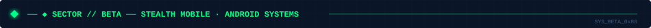
</div>

### 📱 Sector Beta — Stealth Mobile & Android Systems
*Native Kotlin applications, hardware-level broadcast receivers, and reactive Jetpack Compose interfaces.*

| Codebase | Architectural Domain | Core Stack | Description |
| :--- | :--- | :--- | :--- |
| [`ChupChap`](https://github.com/YasirAminBrohi/ChupChap) | **Stealth Capture Engine** | `Kotlin` • `CameraX Headless` • `Foreground Svc` | Silent, hardware-triggered media capture via physical volume keys without waking the display. |
| [`Woof-App`](https://github.com/YasirAminBrohi/Woof-App) | **Material 3 UI Architecture** | `Kotlin` • `Jetpack Compose` • `State Hoisting` | Reactive Android interface exploring Material Design 3 tokens and spring-physics animations. |
| [`Tip-Calculator-App`](https://github.com/YasirAminBrohi/Tip-Calculator-App) | **Mobile Utility System** | `Kotlin` • `Android Jetpack` • `Compose` | Clean stateful calculations and dynamic currency rounding. |
| [`Dice-App`](https://github.com/YasirAminBrohi/Dice-App) | **Hardware RNG Interface** | `Kotlin` • `Jetpack Compose` | Fast RNG visualization with optimized vector state handling. |

<br/>

<div align="center">
  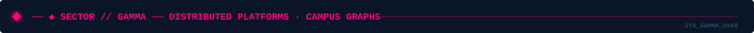
</div>

### 🌐 Sector Gamma — Distributed Platforms & Campus Graphs
*Graph-based routing engines, high-speed universal stream extractors, and full-stack web applications.*

| Codebase | Architectural Domain | Core Stack | Description |
| :--- | :--- | :--- | :--- |
| [`Jagha`](https://github.com/YasirAminBrohi/Jagha) | **Campus Seating Router** | `TypeScript` • `React` • `FAST Graph Engine` | High-precision exam seating plan & venue navigation engine crafted for FAST-NUCES Karachi students. |
| [`Volia`](https://github.com/YasirAminBrohi/Volia) | **Media Client Interface** | `React.js` • `Vite` • `Tailwind CSS` | Ultra-responsive universal media downloader and stream extraction frontend with glassmorphism UI. |
| [`Volia-Backend`](https://github.com/YasirAminBrohi/Volia-Backend) | **Stream Extraction Core** | `Node.js` • `Express` • `Stream Demuxer` | High-throughput stream parsing and format conversion backend engine. |
| [`inotebook-backend`](https://github.com/YasirAminBrohi/inotebook-backend) • [`frontend`](https://github.com/YasirAminBrohi/inotebook-frontend) | **Authenticated Cloud Vault** | `MongoDB` • `Express` • `React` • `JWT` | Full-stack cloud notes management application featuring secure JWT authentication and encrypted CRUD. |
| [`portfolio`](https://github.com/YasirAminBrohi/portfolio) | **Developer Showcase** | `React` • `Vite` • `Tailwind CSS` | High-performance personal portfolio highlighting software engineering projects and live demos. |

<br/>

<div align="center">
  
</div>

### ⚙️ Sector Delta — Low-Level Systems & CLI Runtimes
*Cross-platform terminal PTY translation, ultra-low latency desktop audio, and deterministic C matrix engines.*

| Codebase | Architectural Domain | Core Stack | Description |
| :--- | :--- | :--- | :--- |
| [`wacli_window`](https://github.com/YasirAminBrohi/wacli_window) | **Windows PTY Port** | `Go (Golang)` • `Win32 API` • `CLI Signals` | Ported Unix-exclusive `wacli` to Windows, resolving low-level PTY, socket, and console signal barriers. |
| [`Soundboard`](https://github.com/YasirAminBrohi/Soundboard) | **Native Desktop Audio** | `Rust` • `Tauri` • `Audio Pipelines` | Ultra-low latency desktop soundboard engine built with Rust and Tauri for instant audio dispatching. |
| [`Games_In_2DArray_C`](https://github.com/YasirAminBrohi/Games_In_2DArray_C) | **Matrix Game Simulation** | `C Language` • `2D Arrays` • `Algorithms` | Algorithmic board game engines implementing deterministic matrix state manipulation in pure C. |

<br/>

---

## 🔬 05 // FLAGSHIP ARCHITECTURAL DOSSIERS

<br/>

### 🔮 DOSSIER 01: Browser Protocol Interception & Metadata Synthesis
**Core Codebases:** [`WhatsappSpam`](https://github.com/YasirAminBrohi/WhatsappSpam) • [`WhatsappForward`](https://github.com/YasirAminBrohi/WhatsappForward) • [`Jadu`](https://github.com/YasirAminBrohi/Jadu)

<div align="center">
  
</div>

* **The Problem:** Modern Single Page Applications and secure messengers run in tightly isolated sandboxes, preventing programmatic batching and blocking custom header injection.
* **The Solution:** Engineered Chromium MV3 extensions using TypeScript and esbuild that hook into WhatsApp Web's internal UI and metadata state machines.
* **Key Mechanics:**
  * **Native Sticker Injection:** Transparent format conversion directly into internal message queues without canvas distortion.
  * **Forwarded Protocol Spoofing:** Injects authentic protocol-level metadata attributes into new outgoing payloads, making original messages behave as forward verified packets.
  * **Burst Throttling:** Human-jitter queueing algorithm preventing client-side connection throttling.

<br/>

---

### 🤫 DOSSIER 02: Headless Hardware-Triggered Android Subsystems
**Core Codebase:** [`ChupChap`](https://github.com/YasirAminBrohi/ChupChap)

<div align="center">
  
</div>

* **The Problem:** Standard Android camera implementations require waking the screen, requesting window viewports, and binding to a viewfinder preview, causing latency and zero privacy.
* **The Solution:** A native Kotlin Android background service binding directly to hardware key event dispatchers.
* **Key Mechanics:**
  * **Headless CameraX Capture:** Captures high-resolution frames directly from the image buffer without binding to a visual `PreviewView`.
  * **Hardware Broadcast Receivers:** Listens for physical button combinations while the device CPU operates in low-power lockscreen states.
  * **Encrypted Sandbox Storage:** Streams media bytes directly to application-private internal storage.

<br/>

---

### 🪟 DOSSIER 03: Cross-Platform CLI & Native Desktop Audio
**Core Codebases:** [`wacli_window`](https://github.com/YasirAminBrohi/wacli_window) • [`Soundboard`](https://github.com/YasirAminBrohi/Soundboard)

<div align="center">
  
</div>

* **wacli_window (Go / Win32):** Ported Unix-exclusive terminal CLI tooling to Windows by rewriting pseudoterminal (PTY) handling, adapting OS signal traps, and standardizing cross-platform console escape sequences.
* **Soundboard (Tauri / Rust):** High-performance desktop audio playback engine using Rust backends to stream low-latency audio buffers for livestreams without high CPU or memory overhead.

<br/>

---

### 📍 DOSSIER 04: Campus Seating Graph Routing & Media Extraction
**Core Codebases:** [`Jagha`](https://github.com/YasirAminBrohi/Jagha) • [`Volia`](https://github.com/YasirAminBrohi/Volia) • [`Volia-Backend`](https://github.com/YasirAminBrohi/Volia-Backend)

<div align="center">
  
</div>

* **Jagha (FAST-NUCES Seating Router):** Graph-based navigation engine developed specifically for FAST-NUCES Karachi campus students to compute exam seat coordinates, room layouts, and peer proximity mapping in sub-second queries.
* **Volia Universal Engine:** Universal media downloader with a sleek React glassmorphism interface and a dedicated stream extraction backend capable of multi-source audio/video stream demuxing.

<br/>

---

## 🛠️ 06 // ENGINEERING RUNTIME TOPOLOGY

<div align="center">
  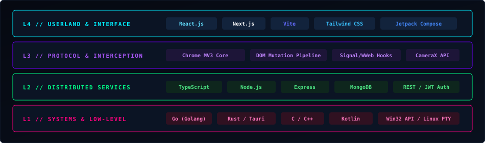
</div>

<br/>

```
  ================================================================================
  LAYER SPECIFICATION // VERIFIED ARSENAL
  ================================================================================
  [L4 - INTERFACE]     :: React.js • Next.js • Vite • Tailwind CSS • Jetpack Compose • Material 3
  [L3 - INTERCEPTION]  :: Chrome Manifest V3 • DOM Mutator Engines • Protocol Hooks • CameraX Headless
  [L2 - SERVICES]      :: TypeScript • Node.js • Express.js • MongoDB • MySQL • REST APIs • JWT
  [L1 - RUNTIME]       :: Go (Golang) • Rust • Tauri • C/C++ • Kotlin • Linux Bash • Win32 API
```

<br/>

---

## 🌌 07 // TECHNOLOGY CONSTELLATION & RADAR

<div align="center">
  
</div>

<br/>

---

## 📊 08 // LIVE SYSTEM TELEMETRY

<div align="center">
  <!-- DYNAMIC TELEMETRY SVG UPDATED VIA GITHUB ACTIONS CRON -->
  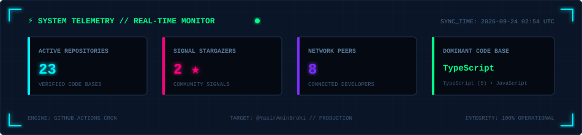
</div>

<br/>

---

## 📈 09 // ACTIVITY SIGNAL WAVEFORM

<div align="center">
  
</div>

<br/>

---

## 📡 10 // SECURE UPLINK CHANNELS

<div align="center">

  <p><i>Ready for collaborative systems development, browser engineering contracts, or technical inquiries.</i></p>

  <a href="https://www.linkedin.com/in/yasiraminbrohi/">
    
  </a>
  &nbsp;&nbsp;
  <a href="mailto:yasiraminbrohi@gmail.com">
    
  </a>
  &nbsp;&nbsp;
  <a href="https://github.com/YasirAminBrohi">
    
  </a>

  <br/><br/>

  <!-- FOOTER TERMINAL SVG -->
  

</div>